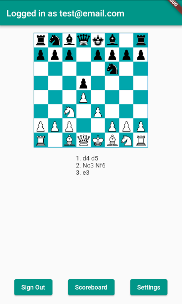

# Chess Flutter App

This is a simple chess app developed for the "Lab of Mobile Devices" course. The app allows users to play a local game of chess, save custom settings such as board color, and compete in an online scoreboard using Firebase authentication and Firestore database.

